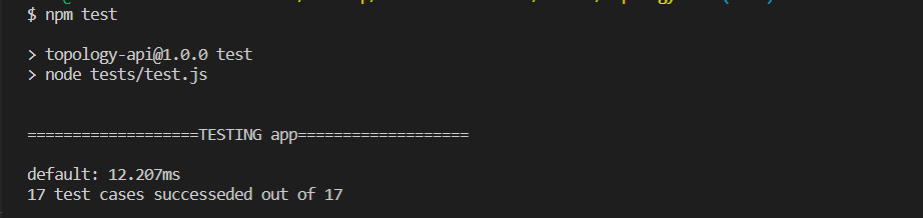

# Topology-API

an API library that access, manage and store device topologies

## 💻 Built Using <a name = "tech"></a>

- **JS**

## Dependencies

- node
- npm

## 🏁 Get Started <a name = "Install"></a>

```
git clone https://github.com/omar214/Topology-API.git
```

```
cd Topology-API
```

```
node app.js
```

## run test

```
npm test
```

## 📷 Screenshots

 <div name="Screenshots" align="center">
 </a>
 <hr>

 </div>
